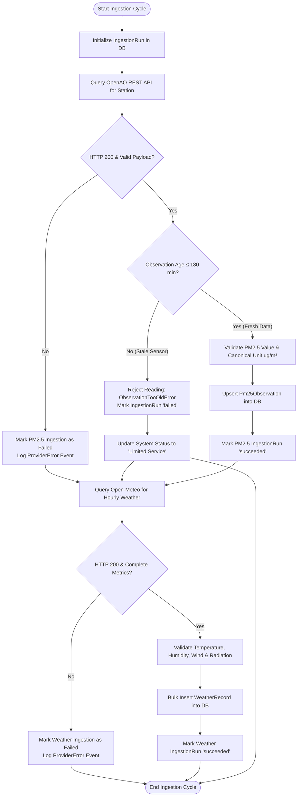
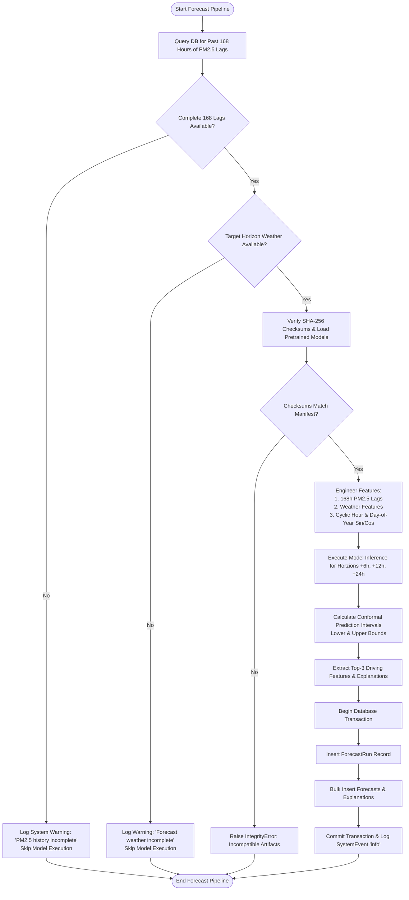

# AirAware – Activity Diagrams

## 1. Overview
The Activity Diagrams illustrate the step-by-step business logic, decision gates, guardrails, and exception-handling pathways in AirAware.

Two key workflows are modeled:
1. **Live Data Ingestion & Staleness Guardrail Decision Flow**
2. **Operational Machine Learning Forecast Generation Pipeline**

---

## 2. Activity Diagram 1: Live Ingestion & Staleness Guardrails

---

## 3. Activity Diagram 2: Operational ML Forecast Generation Pipeline

