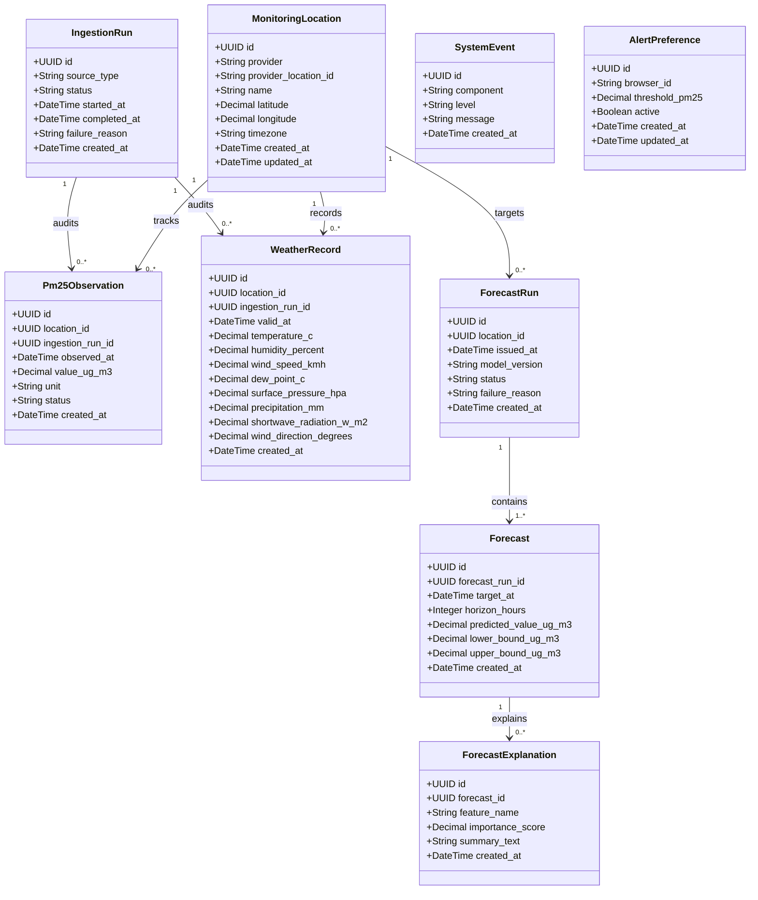

# AirAware – Class Diagram

## 1. Overview
The Class Diagram captures the **Domain and Data Access Layer** of AirAware. It models the SQLAlchemy ORM entities stored in PostgreSQL, their primary and foreign key constraints, data types, and multiplicities.

---

## 2. Mermaid Class Diagram

---

## 3. Entity Dictionary & Relationships

### Core Domain Entities
1. **`MonitoringLocation`**:
   - Represents the physical air monitoring station in New Delhi (e.g. Anand Lok or Central Delhi).
   - Serves as the spatial root for all observation and forecast records.
2. **`Pm25Observation`**:
   - Stores approved ground-truth PM2.5 readings ingested from OpenAQ.
   - Constrained by unique `(location_id, observed_at)` to prevent duplicate recordings.
3. **`WeatherRecord`**:
   - Stores synchronized hourly meteorological features ingested from Open-Meteo.
   - Constrained by unique `(location_id, valid_at)`.
4. **`ForecastRun`**:
   - Encapsulates a single ML execution cycle at a specific issue timestamp (`issued_at`).
   - Tracks the model version and whether the cycle succeeded or encountered validation issues.
5. **`Forecast`**:
   - Multi-horizon prediction points (e.g., +1h, +6h, +12h, +24h, +48h).
   - Contains point predictions alongside conformal prediction intervals (`lower_bound_ug_m3`, `upper_bound_ug_m3`).
6. **`ForecastExplanation`**:
   - Stores the top influential features (e.g. wind speed, diurnal cycle, 24-hour lag) and human-readable explanations.
7. **`IngestionRun` & `SystemEvent`**:
   - Provide complete operational auditability. Every provider call is tracked with start/completion times and failure diagnostics.
8. **`AlertPreference`**:
   - Stores client-side browser notification preferences and threshold values without requiring personal authentication.
