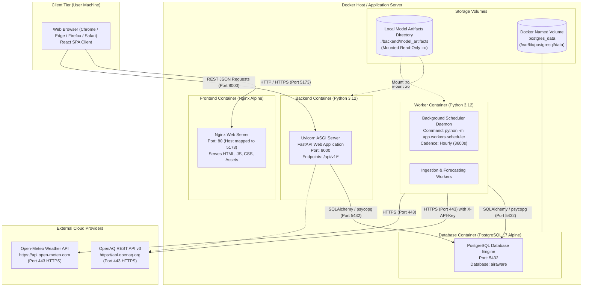

# AirAware – Deployment Diagram

## 1. Overview
The Deployment Diagram illustrates the physical and containerized architecture of **AirAware**, including network protocols, port mappings, inter-container communication, persistent storage volumes, and external API integrations.

---

## 2. Mermaid Deployment Diagram

---

## 3. Node Specifications & Port Configuration

| Node / Container | Base Image / Technology | Network Ports | Purpose |
| :--- | :--- | :--- | :--- |
| **`ClientDevice`** | Web Browser | N/A | Renders client UI, charts, and activity planner interactive clock. |
| **`frontend`** | `node:20-alpine` (builder) / `nginx:alpine` | `5173:80` | Serves compiled static Vite production bundle. |
| **`backend`** | `python:3.12-slim` | `8000:8000` | Exposes REST APIs for status, observations, forecasts, and planner. |
| **`worker`** | `python:3.12-slim` | Internal | Runs background hourly cycle (`ingest` $\rightarrow$ `forecast`). |
| **`postgres`** | `postgres:17-alpine` | `5432:5432` | Relational persistence with healthcheck (`pg_isready`). |
| **`postgres_data`** | Docker Named Volume | Local Disk | Persists PM2.5 readings, forecasts, and logs across restarts. |
| **`model_artifacts`** | Host Directory Mount | Local Disk | Houses pre-trained ML models (`.pkl`, `.pt`) verified via SHA-256. |
