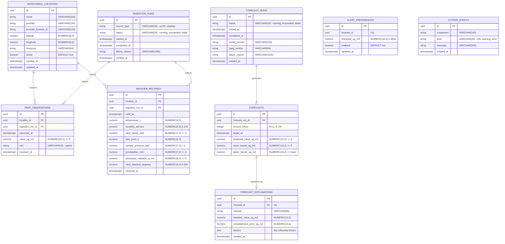

# AirAware – Entity Relationship Diagram (ERD)

## 1. Overview
The **Entity Relationship Diagram (ERD)** models the physical relational database schema of **AirAware** hosted in **PostgreSQL 17**. 

It details all table schemas, primary keys (`PK`), foreign keys (`FK`), unique constraints (`UQ`), check constraints (`CK`), data types, and cardinality notations (Crow's Foot notation).

---

## 2. Mermaid ER Diagram

---

## 3. Database Schema Dictionary & Constraints

### 1. `monitoring_locations`
- **Primary Key**: `id (UUID)`
- **Unique Constraint**: `uq_monitoring_locations_provider_location (provider, provider_location_id)`
- **Check Constraints**:
  - `ck_monitoring_locations_latitude_range`: `-90 <= latitude <= 90`
  - `ck_monitoring_locations_longitude_range`: `-180 <= longitude <= 180`
- **Description**: Stores spatial stations (e.g., OpenAQ Anand Lok or Central Delhi).

### 2. `pm25_observations`
- **Primary Key**: `id (UUID)`
- **Foreign Keys**:
  - `location_id` $\rightarrow$ `monitoring_locations(id)` ON DELETE RESTRICT
  - `ingestion_run_id` $\rightarrow$ `ingestion_runs(id)` ON DELETE RESTRICT
- **Unique Constraint**: `uq_pm25_observations_location_observed_at (location_id, observed_at)`
- **Check Constraints**:
  - `ck_pm25_observations_non_negative_value`: `value_ug_m3 >= 0`
  - `ck_pm25_observations_unit`: `unit = 'ug/m3'`
- **Description**: Ground-truth hourly PM2.5 observations from OpenAQ.

### 3. `weather_records`
- **Primary Key**: `id (UUID)`
- **Foreign Keys**:
  - `location_id` $\rightarrow$ `monitoring_locations(id)` ON DELETE RESTRICT
  - `ingestion_run_id` $\rightarrow$ `ingestion_runs(id)` ON DELETE RESTRICT
- **Unique Constraint**: `uq_weather_records_location_valid_at (location_id, valid_at)`
- **Check Constraints**:
  - `ck_weather_records_humidity_range`: `0 <= humidity_percent <= 100`
  - `ck_weather_records_non_negative_wind_speed`: `wind_speed_kmh >= 0`
  - `ck_weather_records_positive_surface_pressure`: `surface_pressure_hpa > 0`
  - `ck_weather_records_wind_direction_range`: `0 <= wind_direction_degrees <= 360`
  - `ck_weather_records_non_negative_precipitation`: `precipitation_mm >= 0`
  - `ck_weather_records_non_negative_radiation`: `shortwave_radiation_w_m2 >= 0`
- **Description**: Hourly weather observations and forecasts from Open-Meteo.

### 4. `forecast_runs`
- **Primary Key**: `id (UUID)`
- **Check Constraint**: `status IN ('running', 'succeeded', 'failed')`
- **Description**: Tracks operational model execution cycles, input snapshot hashes, and failure diagnostics.

### 5. `forecasts`
- **Primary Key**: `id (UUID)`
- **Foreign Key**: `forecast_run_id` $\rightarrow$ `forecast_runs(id)` ON DELETE RESTRICT
- **Unique Constraint**: `uq_forecasts_run_horizon (forecast_run_id, horizon_hours)`
- **Check Constraints**:
  - `ck_forecasts_supported_horizon`: `horizon_hours IN (1, 6, 24)`
  - `ck_forecasts_non_negative_prediction`: `predicted_value_ug_m3 >= 0`
  - `ck_forecasts_non_negative_lower_bound`: `lower_bound_ug_m3 >= 0`
  - `ck_forecasts_ordered_bounds`: `upper_bound_ug_m3 >= lower_bound_ug_m3`
- **Description**: Multi-horizon predictions with conformal prediction bounds.

### 6. `forecast_explanations`
- **Primary Key**: `id (UUID)`
- **Foreign Key**: `forecast_id` $\rightarrow$ `forecasts(id)` ON DELETE CASCADE
- **Unique Constraint**: `uq_forecast_explanations_forecast (forecast_id)` (1-to-1 with `forecasts`)
- **Description**: Stores explainable AI (XAI) feature importance rankings and contributions for each prediction.

### 7. `alert_preferences`
- **Primary Key**: `id (UUID)`
- **Unique Constraint**: `uq_alert_preferences_browser_id (browser_id)`
- **Check Constraint**: `threshold_ug_m3 > 0 AND threshold_ug_m3 <= 2000`
- **Description**: Anonymous browser client alert thresholds.

### 8. `ingestion_runs`
- **Primary Key**: `id (UUID)`
- **Check Constraints**:
  - `ck_ingestion_runs_source_type`: `source_type IN ('pm25', 'weather')`
  - `ck_ingestion_runs_status`: `status IN ('running', 'succeeded', 'failed')`
- **Description**: Audit trail for each automated ingestion attempt.

### 9. `system_events`
- **Primary Key**: `id (UUID)`
- **Check Constraint**: `level IN ('info', 'warning', 'error')`
- **Description**: Operational logging and reliability telemetry table.
