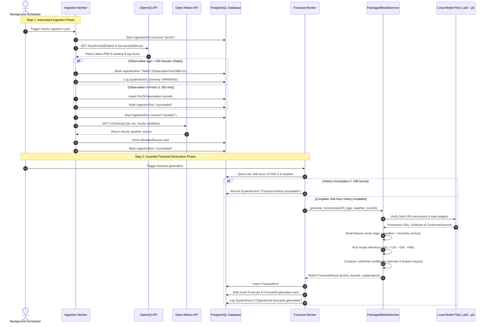
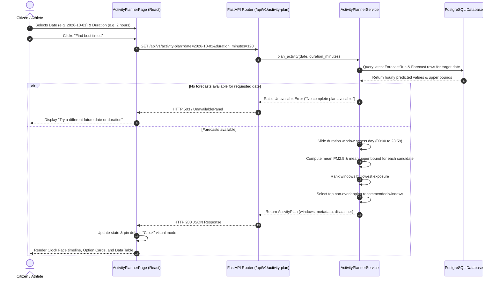

# AirAware – Sequence Diagrams

## 1. Overview
The Sequence Diagrams model the dynamic runtime interactions between frontend components, backend services, external APIs, and the PostgreSQL database.

Two critical flows are modeled:
1. **Automated Ingestion & Machine Learning Forecasting Pipeline** (System workflow)
2. **Activity Planning & Optimal Window Generation** (User interaction workflow)

---

## 2. Diagram 1: Automated Ingestion & Operational ML Forecasting

This sequence runs automatically every hour via the worker daemon (`python -m app.workers.scheduler`).

---

## 3. Diagram 2: Activity Planner Request Workflow

This sequence models a user looking for the cleanest outdoor exercise or commuting window.

