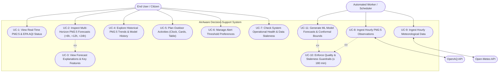

# AirAware – Use Case Diagram

## 1. Overview
The Use Case Diagram describes the functional interactions between the different actors and the **AirAware** decision-support system. It highlights citizen-facing air quality monitoring, proactive activity planning, automated real-time data ingestion, and operational machine learning forecasting.

---

## 2. Actors
- **End User (Citizen / Sensitive Individual / Athlete)**: Interacts with the web application to monitor air quality, plan outdoor activities, review historical model accuracy, and configure notifications.
- **Automated Scheduler (System Actor)**: Background worker running on an hourly cadence to trigger data ingestion and ML model inference.
- **OpenAQ API (Secondary / External Actor)**: External data source providing live and historical ground-level PM2.5 observations.
- **Open-Meteo API (Secondary / External Actor)**: External data source providing hourly meteorological history and 48-hour weather forecasts.

---

## 3. Mermaid Use Case Diagram

---

## 4. Use Case Specifications

| Use Case ID | Name | Primary Actor | Description |
| :--- | :--- | :--- | :--- |
| **UC-1** | View Real-Time PM2.5 & EPA AQI Status | End User | Displays latest verified PM2.5 reading, timestamp, data age, and US EPA 2024 category badge. |
| **UC-2** | Inspect Multi-Horizon Forecasts | End User | Presents +6h, +12h, and +24h point forecasts with calibrated conformal uncertainty bounds. |
| **UC-3** | View Forecast Explanations | End User | Explains top model drivers (e.g. wind speed, humidity, PM2.5 persistence). |
| **UC-4** | Explore Historical Trends | End User | Visualizes recent PM2.5 vs forecasts across 24h, 72h, or 168h timeframes. |
| **UC-5** | Plan Outdoor Activities | End User | Allows user to pick date and duration to receive ranked lowest-exposure time windows in Clock, Card, or Table mode. |
| **UC-6** | Manage Alert Preferences | End User | Allows users to store browser-based PM2.5 threshold warnings for critical air conditions. |
| **UC-7** | Check Operational Health | End User | Indicates whether live pipelines are operational, limited, or degraded without displaying stale data. |
| **UC-8** | Ingest Hourly PM2.5 | Scheduler | Collects latest reading and required 168-hour history lags from OpenAQ. |
| **UC-9** | Ingest Meteorological Data | Scheduler | Collects synchronized weather features and forecasts from Open-Meteo. |
| **UC-10**| Enforce Quality Guardrails | System | Rejects observations older than 180 minutes and validates 168-hour lag completeness. |
| **UC-11**| Generate ML Forecasts | Scheduler | Executes GRU and XGBoost model ensembles with conformal prediction intervals. |
